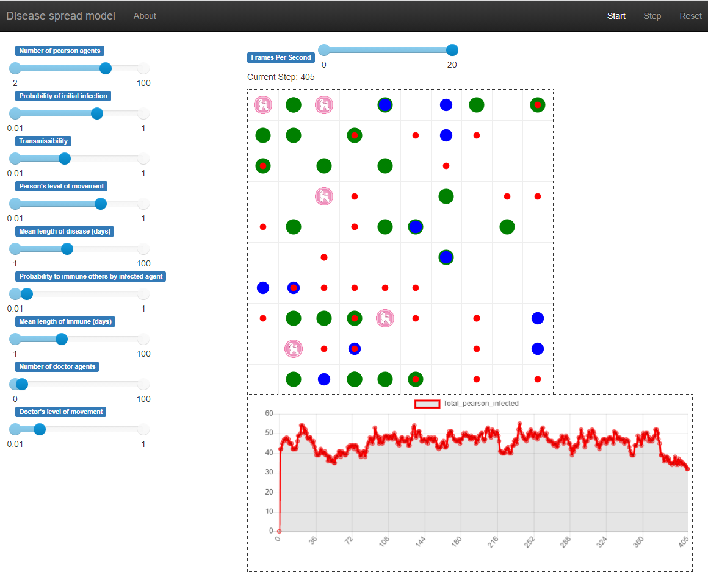

# Agent-based modelling of COVID-19 pandemic in Poland

Project implements [mesa](https://mesa.readthedocs.io/en/stable/index.html) and [mesa-geo](https://github.com/Corvince/mesa-geo) 
to predict number of people infected by COVID-19 in Poland and analyze the course of the pandemic.

The goal is based on three steps.
* First step is collecting data about sizes and number of households in Poland
and collecting data about course of pandemic (mainly deaths) in Poland.
* Second step is to build [Evgeniy Khain](https://journals.aps.org/pre/abstract/10.1103/PhysRevE.102.022313) model and adjust it to collected data.
* The final step is to draw conclusions and predictions about the course of the pandemic in Poland.

Original idea comes from [Evgeniy Khain](https://journals.aps.org/pre/abstract/10.1103/PhysRevE.102.022313)
and assumes two-level model of quarantine. On the smallest level people are grouped in a star-network structure.
Pearson in the center  maintains large number of interactions between other people in that cluster.
Number of interactions between other people is limited. On the second level clusters are placed on 2D lattice
with nearest-neighbour interactions. It corresponds to real life situations, because  we can group people in smaller communities
like inhabitants of a given village in which one pearson is a cashier in grocery store.
Sometimes inhabitants of different communities interact with each other, but it's unlikely if we compare that to interaction within the same community.
In that analogy inhabitants of village makes one star-network structure with a cashier as center.
Villages can't move, and they are separated like spaces on a 2D the lattice grid.

Since I haven't decided yet if my model will run on 2D lattice ([mesa](https://mesa.readthedocs.io/en/stable/index.html)) or
on the real map of a country  ([mesa-geo](https://github.com/Corvince/mesa-geo)) I am experimenting with mesa and mesa-geo.


## Installation
### Mesa
Mesa installation is straightforward
```shell
pip install mesa
```
To run my model created in that framework go to [my_models/mesa_grid_disease](my_models/mesa_grid_disease) and run [run.py](my_models/mesa_grid_disease/run.py).

For more examples go to [mesa GitHub repository.](https://github.com/projectmesa/mesa)

<br />

### Mesa-geo
Mesa-geo installation is a bit more complex and depends on your operating system.

To install mesa-geo on **linux** or **macOS** run:
```shell
pip install mesa-geo
```
<br />

On **Windows** you should first use [Anaconda python distribution](https://www.anaconda.com/products/individual) to install the requirements with command:
```shell
conda install fiona pyproj rtree shapely
```
Then in the environment in which you entered above command use standard command:
```shell
pip install mesa-geo
```

## Running examples
Visualisation of simulation in mesa and mesa-geo is displayed in your browser. They should look like in the pictures below.

Visualisation in **mesa**


<br />

Visualisation in **mesa-geo**


<br />

Visualisation of **mesa-geo** sometimes, for unknown reasons, has an error causing not displaying sliders
and agents. Also, in that case simulation will not run, and you can observe picture like this:

I haven't found any satisfying solution to that problem, but what I can recommend is to create new
virtual environment and install mesa-geo in it.